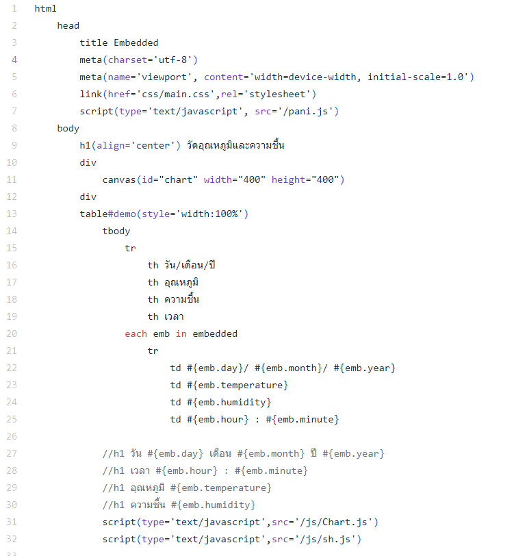
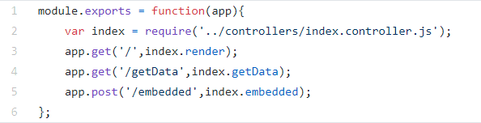

# s60030049

=========================================================
# การทำงาน
1. สร้าง models Schema ชื่อไฟล์ embedded.models สำหรับเก็บข้อมูล

2. เรียกใช้ Chart.js สำหรับสร้างกราฟแสดงผลด้วย canvas(ติดตั้งใช้คำสั่ง npm install chart.js)
และเรียกใช้ sh.js ในการอัพเดทข้อมูลของกราฟบน embedded.jade

3. app-->config-->express.js ตั้งค่าต่าง ๆ อย่าง engine ที่ใช้คือ jade และกำหนดค่า static เพื่อให้สามารถเรียกใช้ css หรือ js มาทำงานได้ง่ายขึ้น

4. app-->config-->mongoose.js การเชื่อมต่อกับ server mongoose 

5. app-->routes-->index.routes.js เมื่อถูกเรียกใช้จะไปเรียกใช้ข้อมูลใน index.controller.js มาแสดง
สร้างไว้เพื่อความสะดวกในการเรียกใช้งานเส้นทางต่าง ๆ 

6. การแสดงผลใช้ engine jade ดังรูปโค้ดด้านล่าง 
ข้อมูลแสดงผลเป็นตารางส่วนกราฟแสดงผลบน canvas โดยดึงผลข้อมูลจากฐานข้อมูลโดยใช้ each วนลูป

